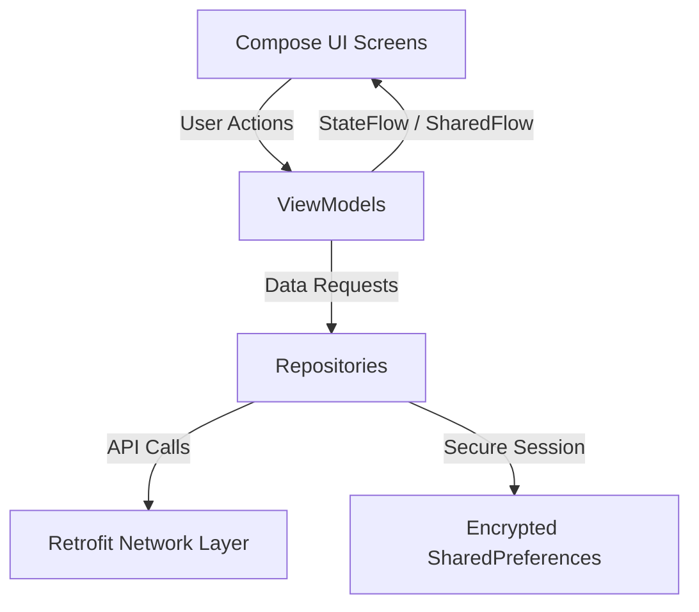
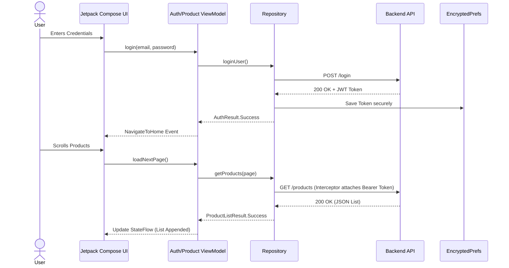

# 🛒 E-Store: Android E-Commerce App


A production-style Android E-Commerce application built to demonstrate modern Android development best practices. It features a fully reactive UI built with **Jetpack Compose**, a robust **Unidirectional Data Flow (UDF)**, and **Clean Architecture** principles.

apk file: https://github.com/RaviRTirkey/android-estore/blob/master/app/release/app-release.apk
---

## 📱 Screenshots

<div align="center">
  
  
  
  
  
  
  
</div>


---

## ✨ Key Features & Technical Highlights

* **🔐 JWT Authentication:** Secure login/signup with session tokens stored securely using `EncryptedSharedPreferences`. Includes a network interceptor for automatic `401 Unauthorized` logouts.
* **♾️ Infinite Scrolling & Pagination:** Optimized data fetching for product lists, dynamically loading the next page just before the user hits the bottom of the screen. Includes pull-to-refresh functionality.
* **📸 Smart Image Processing:** Profile picture uploads utilize an **Iterative Quality Reduction** algorithm with `inSampleSize` downscaling to completely eliminate `OutOfMemoryError` on high-resolution images.
* **🛒 Persistent Shopping Cart:** Real-time quantity updates and precise financial calculations using `BigDecimal` to prevent floating-point errors.
* **🛡️ Form Validation:** Real-time RegEx validation for phone numbers and pincodes in the Checkout flow.
* **🚦 Centralized Navigation:** Segregated `NavHost` for Auth vs. Main flows with a reactive `StartupRoute` decision engine that checks for existing sessions.

---

## 🏗️ Architecture & API Flow

This project strictly adheres to **Clean Architecture** and the **MVVM Pattern**. State is exposed via `StateFlow` and single-shot events (like Navigation or Snackbars) are handled via `SharedFlow`.

### High-Level App Architecture


### Authentication & API Request Flow
This diagram illustrates how secure requests are handled using OkHttp Interceptors:



---

## 🛠️ Tech Stack & Libraries

* **UI Layer:** [Jetpack Compose](https://developer.android.com/jetpack/compose) (Material 3), [Coil](https://coil-kt.github.io/coil/) (Async Image Loading).
* **State Management:** `ViewModel`, `StateFlow`, `SharedFlow`, UDF.
* **Dependency Injection:** [Dagger-Hilt](https://dagger.dev/hilt/).
* **Networking:** [Retrofit2](https://square.github.io/retrofit/), [OkHttp3](https://square.github.io/okhttp/) (Logging & Auth Interceptors).
* **Concurrency:** [Kotlin Coroutines](https://kotlinlang.org/docs/coroutines-overview.html) (Dispatchers.IO for background processing).
* **Security:** [Jetpack Security Crypto](https://developer.android.com/topic/security/data) (`EncryptedSharedPreferences`).

---

## 📂 Project Structure

```text
com.learning.e_store
├── data
│   ├── remote.api         # Retrofit API Interfaces & DTOs
│   ├── local.prefs        # Auth Session Managers & Encrypted Storage
│   └── repository         # Implementations mapping DTOs to Domain Models
├── screen
│   ├── components         # Reusable composables (ProductCards, TextFields)
│   ├── navigation         # NavHost, Routes, Bottom Navigation
│   └── [feature]          # Auth, Cart, Checkout, Home, Categories, Orders
├── viewmodel              # ViewModels, UiState Data Classes, UiEvents
└── ui.theme               # Material 3 Colors, Typography, Shapes
```

---

## 🚀 Getting Started

### Prerequisites
* Android Studio Ladybug (or newer recommended).
* Minimum SDK 24 (Android 7.0), Target SDK 34+.
* A running E-Commerce Backend API (or mock server).

### Installation Steps

1. **Clone the repository:**
   ```bash
   git clone https://github.com/RaviRTirkey/android-estore.git
   ```
2. **Open in Android Studio:**
   Select `File > Open` and choose the cloned directory.
3. **Configure the API Base URL:**
   Locate your `NetworkModule.kt` (or similar DI module) and point `BASE_URL` to your backend server:
   ```kotlin
   const val BASE_URL = "https://tirkey-eshop.up.railway.app/"
   ```
4. **Sync & Run:** Let Gradle sync the dependencies, select an emulator or physical device, and press Run.

---

## 🤝 Contributing
Contributions, issues, and feature requests are welcome! 

## 📄 License
This project is licensed under the MIT License. See the [LICENSE](LICENSE) file for details.
